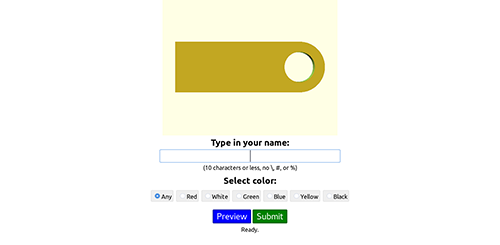

# 3D Printing
---

## Club 3D Printer

As a way to teach members about not only 3d printing, but also electronics and mechanics, the club bought a [Reprappro Monomendel](https://reprappro.com/documentation/mendel-tricolour/) kit for the members to assemble. This kit was chosen because some of the members had built one on their own time, and could help other members putting it together. Once it was build, we rotated the printed between members, so whoever wanted to print something could. After building the club printer, many members wanted their own. They bought the same kit, and used their experience from building the club printer to build their own.

## Nametag Printing at the Fair

With so many members that had their own printers, we needed something for them all to do at the fair. As a way to make some money at it, we came up with the idea of printing custom nametags for fairgoers, for only a dollar each. In order to do this, we needed an automated system to take names, generate the nametag, prepare it for printing, and print it on the printers. To make printing to the printers easier, we set up each printer with a [Raspberry Pi](https://raspberrypi.org) running [Octoprint](http://octoprint.org). This allowed an easy was to a central server to print to each of the printers, without needing to be directly connected to each one.

### The Original Nametag System

The server to collect and print the nametags has benn revised many times since it's initial release. The one used for the first fair we did nametags was based off a Java Tomcat server, and worked reasonably well. Unfortunatly, it began to have issues crashing, printing nametags twice, and other issues. The member that wrote it was leaving the club the year after, and no one else wanted to try and fix it.

### The Second Nametag System

The [second version](https://github.com/Robostorm/Nametag-Auto-Printing) was then written from scratch in the Go language by another member, trying to make it as bulletproof as possible. It got an initial test run at the Maker Day that the club participated in during the spring, allowing a full test before the fair. After some final modifications, it was used at the fair to print to all of the five printers there, and worked great. It never crashed, printed each nametag only once, and did everything it was supposed to.
