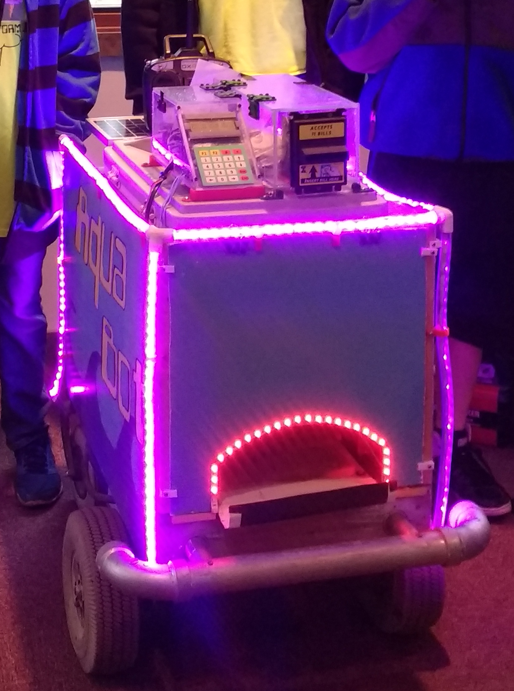

# Aquabot
---

As we were sitting around during our second fair, thirsty for water in the hot sun, we wondered if we could build a robot to bring water to us, rather than having to get water ourselves. And such, the Aquabot was born. We an old powered wheelchair donated to us, and we added remote controls and a cooler with a dispenser and bill acceptor.

## Drive Controls

The first thing we did with the wheelchair was to figure out how to get it to move. The original electronics required a key, and we did not have the charger. We decided instead to rip them out, and add our own. We wanted the Aquabot to be completly safe, so we put a bumper on the front, along with an emergency stop button, that completly disabled movement when hit. The only way to renable it was with either a key or to open the electronics box and flip a switch. We found a nice motor controller to control both motors, and could take inputs directly from the hobby reciever that we were using for remote control. We later added a microcontroller between the reciever and the motor controller in order to smooth out the controls and use a button on the remote as a driving enable.

## Dispenser and Bill Acceptor

The first version of the cooler used a Lego Mindstorms to accept bills and dispense water. It could only hold a few bottles at a time, and would not always dispense reliably. We then decided to replace it with a 3d printed dispenser that was smaller, more reliable, and could hold more bottles. At the same time, the Lego bill acceptor was replaced with a bill acceptor from an old vending machine. To control the new dispenser and bill acceptor, the Lego Mindstorms was replaced with a [Teensy++ 2.0](http://www.pjrc.com/store/teensypp.html) on a custom control board. We also added an LCD and keypad to show bottles left, sold, and allow some configuration. We also added some LED strips around the Aquabot, just for the intense lighting at night. The Teensy provided a nice was to control everthing with a [program](https://github.com/Robostorm/Aquabot-Main) written C.
